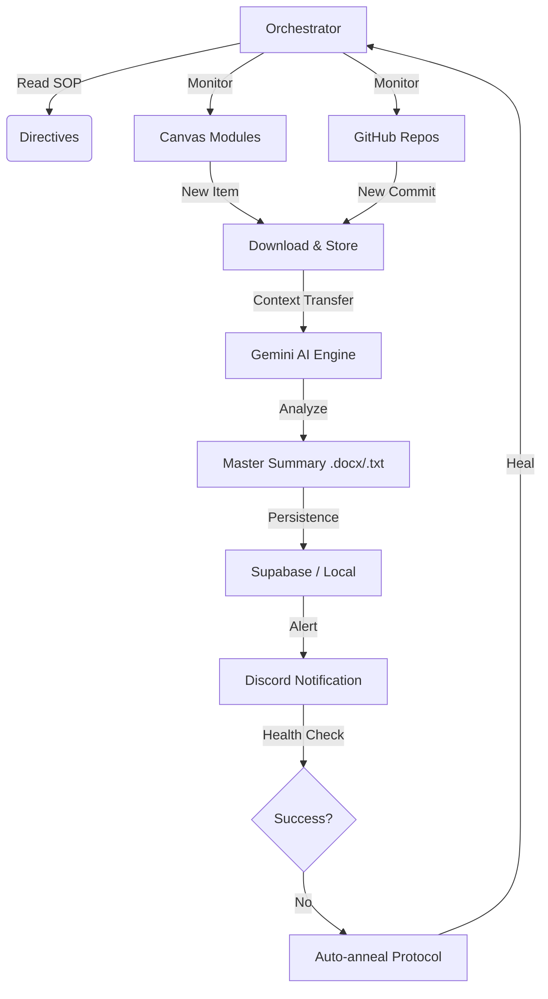

# 🌌 IDP Core: Autonomous Academic Intelligence

> **Elite Monitoring for Higher Education**  
> Um sistema autônomo de monitoramento acadêmico de 3 camadas projetado para converter materiais de aula em inteligência acionável utilizando IA Generativa.

---

## 🏗️ Arquitetura do Sistema (Three-Layer Model)

O IDP Core não é apenas um script de scraping; é um agente orquestrador construído sobre o **Protocolo IDP Core**.

### Layer 1: Diretivas (Intenção)
- Localizadas em `directives/`.
- Procedimentos Operacionais Padrão (SOPs) em Markdown.
- Define o "O Que" deve ser feito de forma determinística.

### Layer 2: Orquestração (Cérebro)
- O **Agente IA** (`orchestrator.py`).
- Toma decisões em tempo real, gerencia o fluxo de trabalho e aplica o protocolo de **Auto-anneal** (auto-cura de scripts) quando falhas de layout são detectadas.

### Layer 3: Execução (Operação)
- Localizada em `execution/`.
- Scripts Python robustos para Login, Monitoramento de Canvas/GitHub, Processamento e Notificação.

---

## 🛠️ Stack Tecnológica

| Componente | Tecnologia | Função |
| :--- | :--- | :--- |
| **Núcleo** | Python 3.10+ | Lógica de negócio e orquestração. |
| **Inteligência** | Gemini 1.5 Flash | Resumos magistrais e inteligência de "Professor Mentor". |
| **Web Ops** | Playwright / Selenium | Autenticação e extração de dados dinâmicos. |
| **Database** | Supabase (PostgreSQL) | Persistência de metadados e histórico acadêmico. |
| **Segurança** | Supabase Vault | Armazenamento seguro de credenciais e segredos. |
| **Alertas** | Discord Webhooks | Notificação instantânea com rich embeds. |

---

## 📊 Fluxo de Trabalho (Workflow)

---

## 🚀 Guia de Início Rápido

### Instalação Automatizada (Recomendado)
Apenas para ambientes Windows:
1.  Clone este repositório.
2.  Renomeie `.env.example` para `.env` e insira suas chaves (Gemini API, Supabase).
3.  Execute o arquivo `run.bat`. O sistema configurará o ambiente virtual e baixará as dependências automaticamente.

### Configuração Supabase
Execute o script `supabase_setup.sql` no seu console do Supabase para inicializar as tabelas de métricas e configurações.

---

## 🛡️ Protocolo de Auto-cura (Auto-anneal)

Diferente de automações convencionais, o IDP Core é resiliente. Se a plataforma acadêmica mudar seu layout:
1.  O script de execução detecta o erro de seletor.
2.  O **Orquestrador IA** analisa o erro e o HTML atual.
3.  O agente propõe ou aplica a correção no script de execução.
4.  As **Diretivas** são atualizadas com o histórico da correção.

---

## 📂 Estrutura de Diretórios

- `directives/`: Manuais e estratégias de scraping.
- `execution/`: O motor de processamento acadêmico.
- `resumos/`: Output final em PDF/DOCX (ignorado pelo Git).
- `.tmp/`: Cache volátil, cookies de sessão e logs de auditoria.
- `stitch/`: (Opcional) Design tokens e assets de interface.

---

## 📖 Documentação Adicional

Para detalhes profundos sobre scripts, infraestrutura Supabase e guias de desenvolvimento, consulte nossa **[Wiki Técnica Mestre](file:///c:/Users/Administrator/Documents/GitHub/antigravity/TECHNICAL_WIKI.md)**.

---
*Desenvolvido para Excelência Acadêmica - Powered by Advanced Agentic Coding.*
