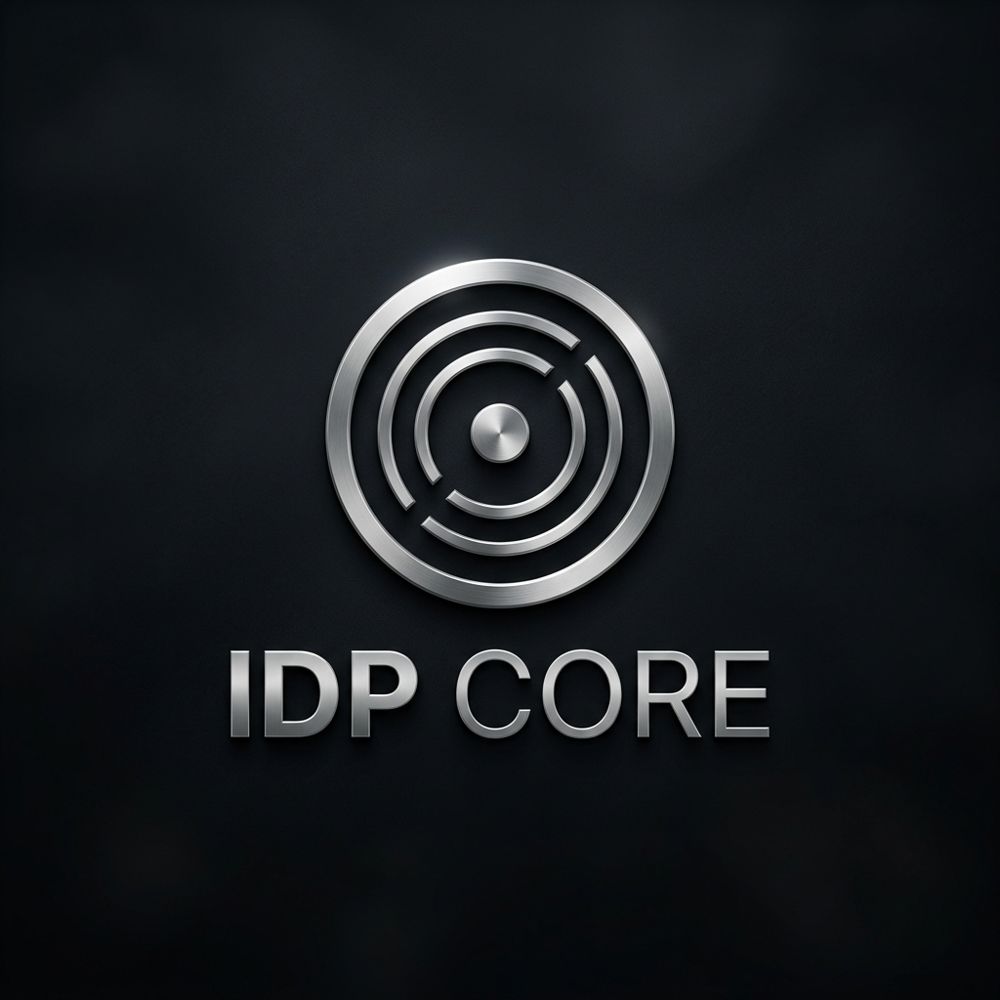

  

  
  
  
  

---

# 🌌 IDP Core: Inteligência Acadêmica de Elite

O **IDP Core** é um sistema autônomo de monitoramento e aceleração de aprendizado. Projetado para estudantes que buscam excelência, o sistema transforma o caos de materiais acadêmicos em um fluxo de inteligência destilada, utilizando a **Arquitetura Onyx** alimentada por IA Generativa.

### [Visualizar Dashboard](file:///c:/Users/Administrator/Documents/GitHub/antigravity/docs/assets/dashboard.png) • [Sistema de Login](file:///c:/Users/Administrator/Documents/GitHub/antigravity/docs/assets/login.png)

---

## ✨ A Experiência Onyx

Diferente de portais acadêmicos tradicionais, o IDP Core oferece uma interface focada em retenção e clareza.

- **🎨 Design System Onyx**: Estética premium inspirada no minimalismo editorial, com suporte a modo escuro profundo, glassmorphism e animações fluidas.
- **📚 Resumos Magistrais**: Motor de IA que processa materiais de aula (PDF, Imagens, Texto) e os transforma em guias de estudo no estilo NotebookLM.
- **🧠 Desafios de Fixação**: Questionários interativos gerados automaticamente para testar sua compreensão imediatamente após a leitura.

---

## 🛠️ Funcionalidades Chave

### 1. Monitoramento Autônomo
O sistema vigia repositórios e plataformas de ensino 24/7, detectando novos conteúdos, cronogramas e atualizações críticas sem intervenção manual.

### 2. Orquestração Multiusuário
Pronto para escalar, o IDP Core utiliza um orquestrador Python que gerencia as diretrizes e preferências de múltiplos alunos, garantindo que cada um receba insights personalizados em seu dashboard.

### 3. Recuperação de Inteligência
Falhas no sistema acadêmico original? O IDP Core possui um protocolo de **Auto-cura** (Auto-anneal) que adapta os robôs de extração a mudanças de layout em tempo real.

---

## 🏗️ Tech Stack

- **Frontend**: React 19, Tailwind CSS, Lucide Icons.
- **Backend**: Python 3.11+, Playwright (Headless Web Ops).
- **Inteligência**: Google Gemini 1.5 Flash.
- **Infraestrutura**: Supabase (PostgreSQL + Realtime), GitHub Actions.

---

## 🚀 Como Iniciar

### Para Alunos
1.  **Acesso**: Entre com suas credenciais na página de login premium.
2.  **Módulos**: Explore suas disciplinas através do carrossel interativo.
3.  **Desafios**: Ao ler um resumo, finalize com o **Desafio de Fixação** para consolidar o conhecimento.

---

  <i>Desenvolvido para transformar dados em sabedoria. Powered by <b>Onyx Intelligence</b>.</i>

